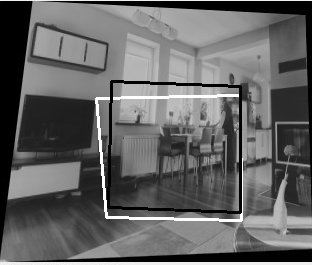

# My AutoPano - Image Stitching 
In this project we are learning to stitch two or more images in order to create a seamless panorama by finding the homohraphy between the two images. 

## Phase 1 : Classical Computer Vision approach 
The claasical method involves several steps, it starts with corner detection. Then Adaptive  Non-maximal Suppression (ANMS) is applied to ensure an even distribution of conrners. Feature descriptors are created by encoding information at each feature point into a vector. The next step is feature matching, where feature points between images are matched. RANSAC is used for outlier rejection and to estimate a robust homography. Finally, the images are blended to produce the panorama.The deatiled steps are explained [here](https://rbe549.github.io/fall2022/proj/p1/).  

### How to Run:
Place the image pairs in the dir:"../Data/Train/Set1/" and run the following command:  
```
 Wrapper.py
```

The classical pipeline is given below:  


### Corner Detection
  

### Non-Maximal Suppression


### Feature Matching 


### Outlier Rejection


### Parorama: Warping, Blending and Stitching


## Phase 2: Deep Learning
The deep learning model effectively combines corner detection, ANMS, feature extraction, feature matching, RANSAC and estimate homography all into one robust generalizable network. The complete methodolgy is given [here](https://rbe549.github.io/fall2022/proj/p1/). 

### How to Run:

Run the following to generate the dataset
```
Datagen.py
```
Divide train and validation. and run:
```
network.py
Train.py
Test.py
```

The network pipeline is given below:  


We followed a supervised model and obtained the follwing results:

The following picture shows the input and output patch from the trained network. 


The training loss over number of epochs is given below:


## Acknowledgement 

This project was part of RBE549- Computer Vision (Fall 22) at Worcester Polytechic Institute[[1]](https://rbe549.github.io/fall2022/proj/p1/).  
Team members :[Thabsheer Machingal](https://github.com/thabsheerjm) and [Krishna Madhurkar](https://github.com/Krishnamadhurkar)

## References 
[1] [RBE549-Project1](https://rbe549.github.io/fall2022/proj/p1/)
